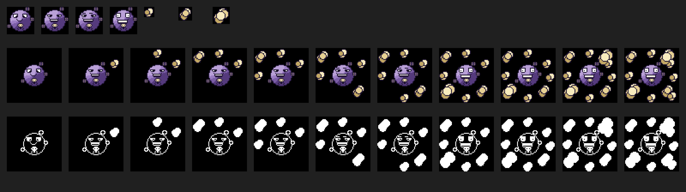
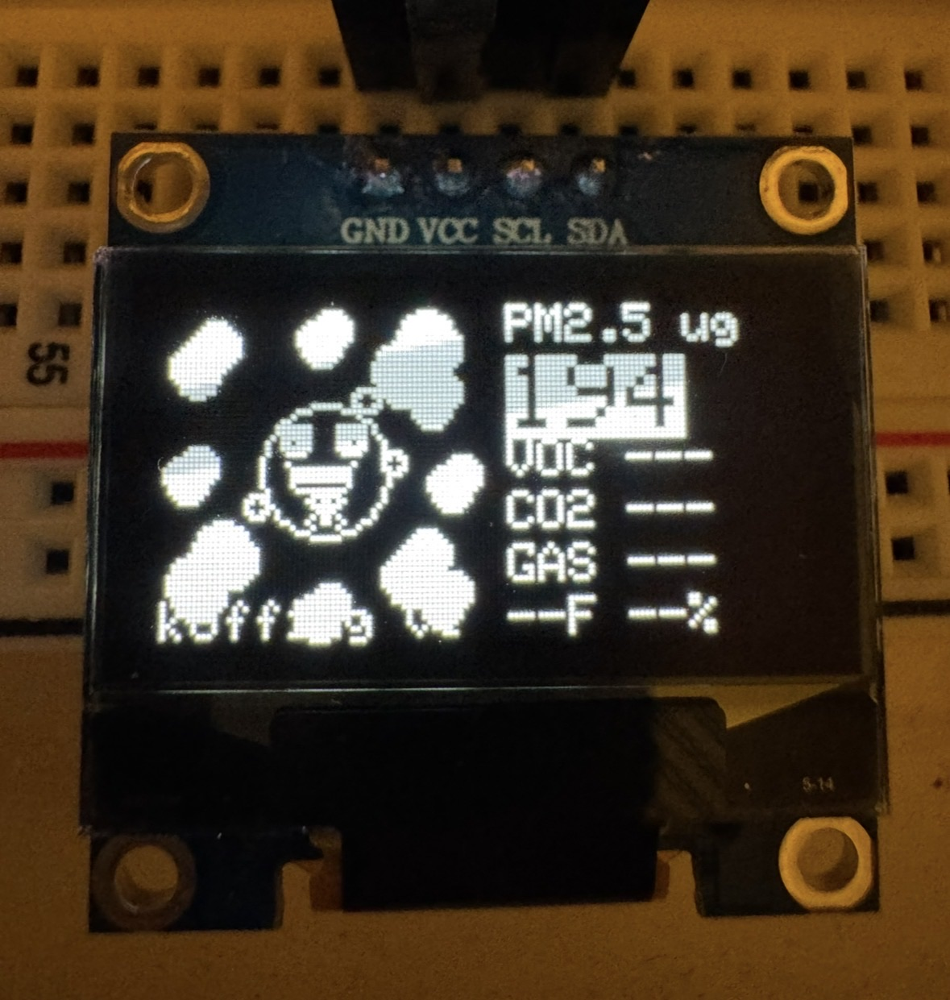
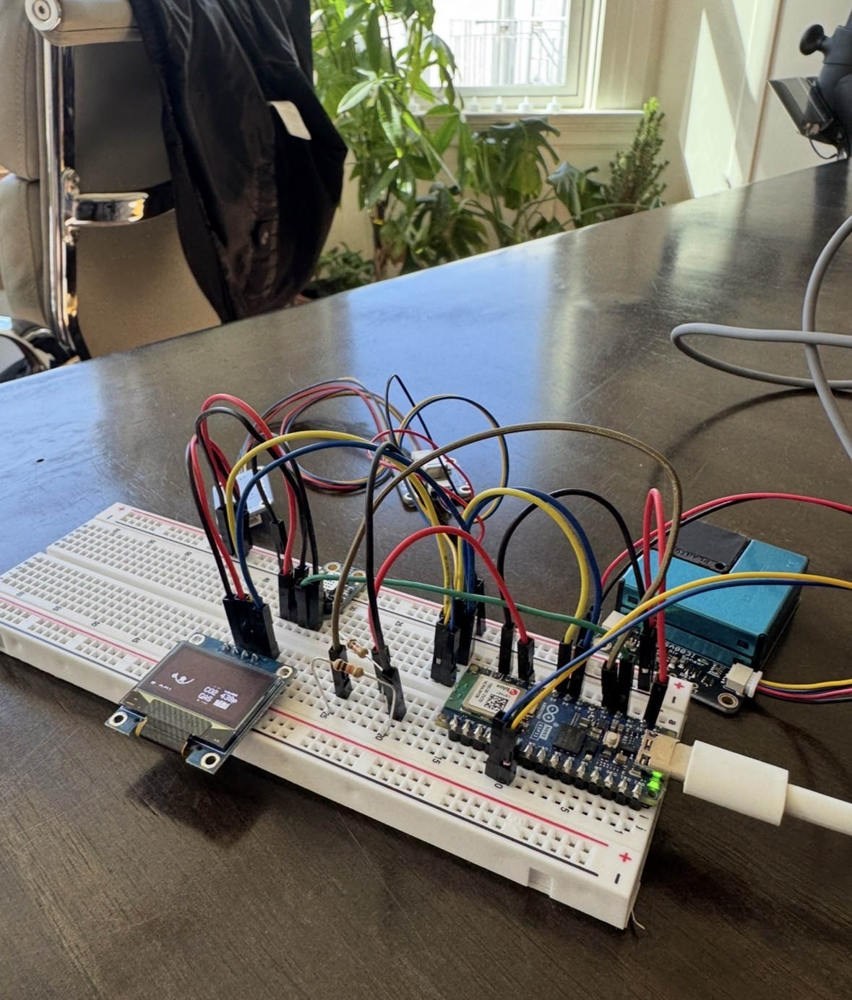

# Koffing

Air quality monitor built around an Arduino Nano ESP32. Reads PM2.5, CO2, VOC, temperature, and humidity, then shows everything on a little OLED with an animated Koffing sprite whose mood tracks how bad the air is.



<p align="center">
  
  &nbsp;&nbsp;
  
  <br>
  <sub>OLED showing basic screen layout during testing</sub>
  &nbsp;&nbsp;&nbsp;&nbsp;&nbsp;&nbsp;&nbsp;&nbsp;&nbsp;&nbsp;&nbsp;&nbsp;&nbsp;&nbsp;&nbsp;&nbsp;&nbsp;&nbsp;&nbsp;&nbsp;&nbsp;&nbsp;&nbsp;&nbsp;&nbsp;&nbsp;
  <sub>Breadboard prototype with all sensors wired up</sub>
</p>

## Hardware

| Component | What it measures | Interface | I2C Addr |
|-----------|-----------------|-----------|----------|
| [PMSA003I](research/pmsa003i.md) | PM1.0 / PM2.5 / PM10 particulate matter | I2C / STEMMA QT | 0x12 |
| [SGP40](research/sgp40.md) | VOC index (1-500) | I2C / STEMMA QT | 0x59 |
| [SCD4x](research/scd4x.md) | CO2 (ppm), temperature, humidity | I2C / STEMMA QT | 0x62 |
| [MiCS5524](research/mics5524.md) | CO / combustible gases (analog) | Analog | N/A |
| [OLED SSD1306](research/oled_ssd1306.md) | 128x64 mono display | I2C | 0x3C |
| [Arduino Nano ESP32](research/nano_esp32.md) | Microcontroller (WiFi-capable) | -- | -- |

The SCD4x handles temp/humidity compensation for the SGP40, so no separate SHT31 needed. MiCS5524 isn't wired up yet. Note: the SCD4x needs real power (not USB from a laptop) — it peaks at 205mA during measurement. The SCD4x is driven with raw Wire I2C commands rather than the Sensirion library (which caused communication failures). See [SCD4x debugging notes](research/scd4x_debugging.md) for the full story.

## Wiring

All I2C sensors daisy-chained via STEMMA QT. OLED on the same bus with jumper wires.

```
                          STEMMA QT daisy chain
Arduino Nano ESP32 ──QT──> PMSA003I ──QT──> SGP40 ──QT──> SCD4x
    A4 (SDA) ─────┐          0x12           0x59          0x62
    A5 (SCL) ───┐ │
                │ │
    GND ──────┐ │ │
    3V3 ────┐ │ │ │       OLED SSD1306 128x64
            │ │ │ │       ┌─────────────────┐
            │ │ │ └─ SDA ─┤ SDA             │
            │ │ └── SCL ──┤ SCL       0x3C  │
            │ └─── GND ──┤ GND             │
            └──── VCC ───┤ VCC             │
                          └─────────────────┘
```

MiCS5524 will eventually go on A0 (5V from VBUS, En! tied to GND).

Full wiring details: [wiring/i2c_chain.md](wiring/i2c_chain.md)

## WiFi Reporting

Koffing publishes sensor readings over MQTT every 5 seconds. A server stack stores historical data and serves dashboards.

```
ESP32 ──MQTT──▶ Mosquitto ──▶ Telegraf ──▶ InfluxDB ◀── Grafana ──▶ browser
```

### ESP32 setup

Copy `secrets.h.example` to `secrets.h` and fill in your WiFi credentials and MQTT broker address:

```bash
cp secrets.h.example secrets.h
# edit secrets.h with your values
```

`MQTT_SERVER` should be the IP or `.local` hostname of whatever machine runs the server stack (e.g. `192.168.1.50` or `my-server.local`).

### Server setup

The server stack (Mosquitto, Telegraf, InfluxDB, Grafana) runs on any Mac via Homebrew. On your server machine:

```bash
git clone <this-repo> && cd koffing/server
./setup.sh
```

This installs Mosquitto, Telegraf, InfluxDB 3, and Grafana via Homebrew, configures them, generates an InfluxDB API token, and starts all four services. It will print the token once — save it if you ever need to debug manually.

Once running:

- **Grafana dashboards:** http://localhost:3000 (default login: admin / admin)
- **InfluxDB:** http://localhost:8181
- **MQTT broker:** localhost:1883

Grafana is accessible from any device on your WiFi — just use the server's IP or `hostname.local`:3000 from your phone or laptop.

To verify data is flowing, subscribe to the MQTT topic:

```bash
mosquitto_sub -t "koffing/sensors"
```

You should see a JSON line every 5 seconds once the ESP32 is connected.

### Server teardown

To stop all services and remove configs (but keep your data):

```bash
cd server
./teardown.sh
```

To also delete all stored sensor data:

```bash
rm -rf ~/.influxdb3_data                            # InfluxDB time-series data
rm -f "$(brew --prefix)/var/lib/grafana/grafana.db"  # Grafana dashboards/settings
```

To fully uninstall the packages:

```bash
brew uninstall mosquitto telegraf influxdb grafana
```

### Data storage

All data lives on the server machine:

| Service | Location | Contents |
|---------|----------|----------|
| InfluxDB | `~/.influxdb3_data/` | All sensor readings (time-series) |
| Grafana | `$(brew --prefix)/var/lib/grafana/` | Dashboard definitions, user settings |
| Mosquitto | In-memory only | No persistence — InfluxDB handles storage |

For architecture details and why this stack was chosen over alternatives: [research/server_stack.md](research/server_stack.md)

## Build

```bash
arduino-cli lib install "PubSubClient"  # first time only
arduino-cli compile --fqbn arduino:esp32:nano_nora .
arduino-cli upload -p /dev/cu.usbmodem* --fqbn arduino:esp32:nano_nora .
arduino-cli monitor -p /dev/cu.usbmodem*
```

## Alert thresholds

These are tuned to flag *suboptimal* conditions, not just dangerous ones. The point is knowing when your air is hurting focus or sleep, not waiting until it's actually unhealthy. Values that cross a threshold show as inverted (black-on-white) on the OLED.

| Sensor | Threshold | What it means |
|--------|-----------|---------------|
| PM2.5 | > 12 µg/m³ | Above EPA "Good." Open a window or run a filter. |
| VOC | > 100 | Sensirion baseline is 100. Above that = air getting worse. |
| CO2 | > 800 ppm | Cognitive performance drops measurably around 800-1000 ppm. |

## Koffing sprite

The OLED shows an animated Koffing whose expression matches air quality. Worse air → bigger grin → more gas clouds on screen.

The sprite takes a single integer (0 = clean, 10 = hazardous):

```c
#include "art/include/koffing_gfx.h"

koffing_draw(display, level, 0, 0);
```

| Level | Face | Clouds |
|-------|------|--------|
| 0 | Happy | None |
| 1-4 | Grin | 1-4, small wisps |
| 5-6 | Thrilled | 5-6, medium puffs |
| 7-10 | Ecstatic | 7-10, big billows |

PM2.5 mapping:

| PM2.5 µg/m³ | Level |
|--------------|-------|
| 0-3 | 0 |
| 4-6 | 1 |
| 7-9 | 2 |
| 10-12 | 3 |
| 13-20 | 4-5 |
| 21-35 | 6-7 |
| 36-55 | 8 |
| 56-100 | 9 |
| 100+ | 10 |

### Regenerating art

Sprites are pixel grids defined in Python, exported as C headers (mono bitmaps + indexed color with RGB565 palettes).

```bash
cd art/generator
uv run python generate.py
```

Outputs `art/include/*.h` (what the sketch uses) and `art/preview/` (PNGs for review). Color sprites use a 4-bit indexed palette, so a shiny variant would just be a palette swap.

## Sensor calibration

### SCD4x (CO2 / temp / humidity)

**Auto Self-Calibration (ASC)** is enabled by default. It assumes the sensor sees fresh outdoor air (~420 ppm) for at least 4 hours once per week. If it lives near a window that gets opened regularly, it'll stay calibrated on its own.

**Forced recalibration** — if readings drift noticeably, expose the sensor to a known CO2 concentration (e.g. outdoor air at ~420 ppm) for 3+ minutes, then call `performForcedRecalibration(targetCo2)`.

**Temperature offset** — the SCD4x self-heats slightly. Use `setTemperatureOffset()` to compensate (0-20C range). Compare against a known-good thermometer and adjust.

**Altitude compensation** — CO2 readings vary with pressure. Call `setSensorAltitude(meters)` once if you're significantly above sea level.

Note: `persistSettings()` saves calibration to EEPROM but only supports ~2000 writes. Don't call it in a loop.

Docs: [Sensirion SCD4x datasheet](https://cdn-learn.adafruit.com/assets/assets/000/104/015/original/Sensirion_CO2_Sensors_SCD4x_Datasheet.pdf?1629489682) · [Adafruit SCD-40 guide](https://learn.adafruit.com/adafruit-scd-40-and-scd-41)

Note: The SCD4x is driven with raw Wire I2C commands instead of the Sensirion library. The Sensirion library's CRC framing caused persistent communication failures where the sensor would ACK commands but never report data ready. The raw approach (inspired by [bb_scd41](https://github.com/bitbank2/bb_scd41)) resolved this. See [debugging log](research/scd4x_debugging.md) for details.

### SGP40 (VOC)

The SGP40's VOC index algorithm is self-calibrating. It continuously learns a baseline over ~12 hours of operation, so readings get more meaningful the longer it runs. Index 100 = average conditions for that environment.

**Temp/humidity compensation** — the sketch feeds SCD4x temp and humidity into `measureVocIndex()` automatically. Without this, it defaults to 25C/50%.

**Tunable parameters** — `voc_index_offset` (default 100), `learning_time_hours` (default 12), `gating_max_duration_min` (default 180). Adjust via the Sensirion VOC Algorithm library if defaults don't suit your environment.

There is no manual calibration procedure. Just give it time to learn.

Docs: [Sensirion SGP40 datasheet](https://sensirion.com/media/documents/296373BB/6203C5DF/Sensirion_Gas_Sensors_Datasheet_SGP40.pdf) · [Adafruit SGP40 guide](https://learn.adafruit.com/adafruit-sgp40)

### PMSA003I (PM2.5)

The PMSA003I is factory-calibrated and has no user-accessible calibration. Readings are computed on-board from laser scattering with built-in correction factors.

**Maintenance** — the intake fan can accumulate dust over time. If readings seem consistently high, gently blow out the inlet with compressed air.

Docs: [Plantower PMSA003I datasheet](https://cdn-shop.adafruit.com/product-files/4632/4505_PMSA003I_series_data_manual_English_V2.6.pdf) · [Adafruit PMSA003I guide](https://learn.adafruit.com/pmsa003i)

## Project structure

```
koffing.ino              Main sketch (sensors + WiFi/MQTT)
secrets.h.example        WiFi/MQTT credentials template
research/                Sensor docs, API notes, architecture decisions
wiring/                  Wiring diagrams
plans/                   Build plans
server/                  Server stack configs and setup script
  setup.sh               Install + configure Mosquitto/Telegraf/InfluxDB/Grafana
  Brewfile               Homebrew package list
  mosquitto/             MQTT broker config
  telegraf/              Data bridge config (MQTT → InfluxDB)
  grafana/               Dashboard provisioning and panel definitions
art/
  include/               Arduino C headers (sprite data + library)
    koffing_gfx.h        Public API — only file you need to include
  preview/               Human-reviewable images
  generator/             Python sprite generator
```

## Research

- [PMSA003I — PM2.5 particulate sensor](research/pmsa003i.md)
- [SGP40 — VOC index sensor](research/sgp40.md)
- [SCD4x — CO2 / temp / humidity sensor](research/scd4x.md)
- [SCD4x debugging log](research/scd4x_debugging.md)
- [MiCS5524 — CO / combustible gas sensor](research/mics5524.md)
- [OLED SSD1306 — 128x64 display](research/oled_ssd1306.md)
- [Arduino Nano ESP32 — board notes](research/nano_esp32.md)
- [Server stack — architecture and design decisions](research/server_stack.md)
- [Build plan](plans/build_plan.md)
